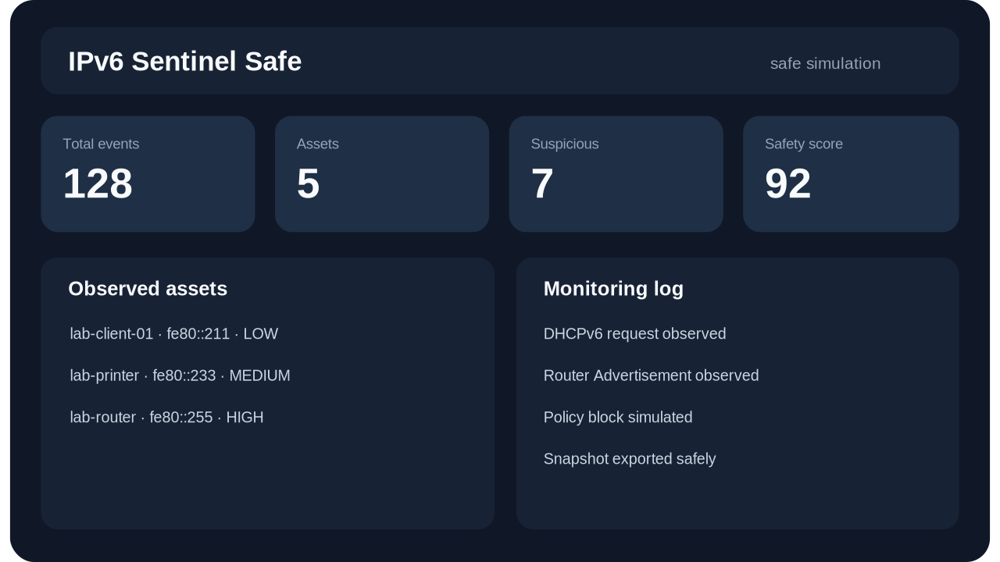

# IPv6 Sentinel Safe

**IPv6 Sentinel Safe**는 IPv6 보안 이벤트를 실제 네트워크 조작 없이 보여주는 **방어형 모니터링/교육용 시뮬레이터**입니다.

이 프로젝트는 포트폴리오, 교육, 시연을 목적으로 합니다. 실제 패킷 캡처, 실제 패킷 전송, 실장비 탐색, DHCP/DNS 변조 기능은 포함하지 않습니다.

## 미리보기



> SVG preview: `docs/assets/dashboard-preview.svg`

## 현재 완성 상태

- 안전 모드 전용 Flask + Socket.IO 대시보드
- 로컬 샘플 자산 생성
- DHCPv6/DNS/Neighbor Discovery/Router Advertisement 관측 이벤트 시뮬레이션
- 의심 패턴/정책 대응 예시 카운트
- 실시간 로그 출력
- CPU/메모리/네트워크 처리량 표시
- 자산 상세 모달
- 설정 저장 기능
- 로그 CSV 내보내기
- 전체 스냅샷 JSON 내보내기
- 원클릭 포트폴리오 데모 시나리오 생성
- 시뮬레이션 초기화 API
- 원격 바인딩 안전장치
- API 보안 헤더 적용
- Windows/macOS/Linux 실행 스크립트
- Docker / Docker Compose 실행 지원
- GitHub Actions CI 워크플로 포함
- 표준 라이브러리 기반 안전성 테스트 포함

## 실행 방법

### Windows

```powershell
python -m venv .venv
.\.venv\Scripts\activate
pip install -r requirements.txt
python app.py
```

또는:

```powershell
run.bat
```

### macOS / Linux

```bash
python3 -m venv .venv
source .venv/bin/activate
pip install -r requirements.txt
python app.py
```

또는:

```bash
chmod +x run.sh
./run.sh
```

브라우저에서 아래 주소를 엽니다.

```text
http://127.0.0.1:5000
```

빠른 시연은 화면 상단의 **데모 시나리오** 버튼을 누르면 됩니다. 샘플 자산, 관측 로그, 안전 점수가 즉시 채워집니다.


## Docker 실행

```bash
IPV6_SENTINEL_PASSWORD=change-me-local-demo docker compose up --build
```

Docker Compose는 외부 포트 노출을 전제로 하므로 Basic Auth를 기본 활성화합니다. 현재 v27 패키지에서도 `IPV6_SENTINEL_PASSWORD` 환경변수를 직접 지정하지 않으면 실행이 실패합니다.

직접 빌드하려면:

```bash
docker build -t ipv6-sentinel-safe:latest .
docker run --rm -p 5000:5000 \
  -e IPV6_SENTINEL_HOST=0.0.0.0 \
  -e IPV6_SENTINEL_WEB_AUTH_ENABLED=1 \
  -e IPV6_SENTINEL_USERNAME=admin \
  -e IPV6_SENTINEL_PASSWORD='change-me-local-demo' \
  ipv6-sentinel-safe:latest
```

## 준비 상태 확인

```bash
python scripts/smoke_check.py --url http://127.0.0.1:5000/api/ready
```

정상 응답은 `ready`입니다.

## 배포 전 검증

```bash
python scripts/run_clean_validation.py
```

Optional full test sweep:

```bash
python scripts/run_full_tests.py
```

The full test sweep runs the full unittest discovery set in one bounded child process with heartbeat output, short post-summary settle cleanup, and process-group timeout cleanup. This avoids repeated interpreter-spawn stalls in constrained sandboxes while still keeping the canonical quick check separate. The observed test count can vary slightly when optional runtime dependencies are or are not installed.

이 명령은 정리된 검증 래퍼를 통해 문법 컴파일, 단위 테스트, 위험 의존성 import 여부, 필수 배포 파일 존재 여부를 확인하고 생성 캐시/런타임 산출물을 정리합니다.

## 선택: 웹 기본 인증 켜기

공유 PC나 로컬망 환경에서 실행할 때는 인증을 켜는 것을 권장합니다.

```bash
export IPV6_SENTINEL_WEB_AUTH_ENABLED=1
export IPV6_SENTINEL_USERNAME=admin
export IPV6_SENTINEL_PASSWORD='change-me-local-demo'
python app.py
```

Windows PowerShell:

```powershell
$env:IPV6_SENTINEL_WEB_AUTH_ENABLED="1"
$env:IPV6_SENTINEL_USERNAME="admin"
$env:IPV6_SENTINEL_PASSWORD="change-me-local-demo"
python app.py
```

## 환경 변수

`.env.example` 파일을 참고하세요.

| 변수 | 기본값 | 설명 |
|---|---:|---|
| `IPV6_SENTINEL_HOST` | `127.0.0.1` | 웹 서버 바인딩 주소 |
| `IPV6_SENTINEL_PORT` | `5000` | 웹 서버 포트 |
| `IPV6_SENTINEL_WEB_AUTH_ENABLED` | `0` | Basic Auth 사용 여부 |
| `IPV6_SENTINEL_USERNAME` | `admin` | 인증 사용자명 |
| `IPV6_SENTINEL_PASSWORD` | 빈 값 | 인증 비밀번호. Docker Compose 실행 시 필수 |
| `IPV6_SENTINEL_LOG_LEVEL` | `INFO` | 로그 레벨 |
| `IPV6_SENTINEL_CORS` | localhost 2개 | Socket.IO 허용 Origin 목록 |
| `IPV6_SENTINEL_ALLOW_INSECURE_REMOTE` | `0` | 인증 없는 원격 바인딩 강제 허용. 일반 사용 비추천 |

## 테스트

의존성 설치 후 아래 명령으로 정적 안전성 테스트와 Flask 라우트 런타임 테스트를 함께 실행합니다.

```bash
python scripts/run_clean_validation.py
```

전체 단위 테스트까지 확인하려면 아래 명령을 추가로 실행합니다.

```bash
python scripts/run_full_tests.py
```

## 안전 설계 원칙

- 기본 바인딩은 `127.0.0.1`입니다.
- `0.0.0.0` 등 원격 접근 가능한 주소로 열려면 기본적으로 인증이 필요합니다.
- CORS 기본값은 localhost 명시 허용이며 와일드카드 `*`를 기본으로 쓰지 않습니다.
- 실시간 대시보드에 표시되는 자산과 이벤트는 모두 로컬 샘플 데이터입니다.
- 운영체제 인터페이스 정보는 읽기 전용으로만 확인합니다.
- 실제 네트워크 트래픽을 만들거나 보내는 의존성은 사용하지 않습니다.
- 로그와 사용자 설정은 로컬 `logs/`, `data/` 폴더에만 저장됩니다.
- 조용한 테스트/리뷰 환경에서는 `IPV6_SENTINEL_LOG_CONSOLE_ENABLED=0`, `IPV6_SENTINEL_LOG_FILE_ENABLED=0`으로 콘솔/파일 로그 생성을 끌 수 있습니다.

## 포트폴리오 설명 문구

> IPv6 Sentinel Safe는 IPv6 환경에서 발생할 수 있는 DHCPv6, DNS, Neighbor Discovery, Router Advertisement 관측 이벤트를 실제 네트워크 조작 없이 시뮬레이션하고, 이를 Flask/Socket.IO 기반 웹 대시보드에서 실시간으로 시각화하는 교육용 보안 모니터링 프로젝트입니다.


## 주요 API

| 경로 | 방식 | 설명 |
|---|---|---|
| `/api/health` | GET | 앱 상태 확인 |
| `/api/info` | GET | 안전 모드/설정 메타데이터 조회 |
| `/api/ready` | GET | 배포/컨테이너 준비 상태 점검 |
| `/api/stats` | GET | 대시보드 통계 조회 |
| `/api/assets` | GET | 로컬 샘플 자산 목록 조회 |
| `/api/logs` | GET | 최근 관측 로그 조회 |
| `/api/logs.csv` | GET | 관측 로그 CSV 다운로드 |
| `/api/snapshot.json` | GET | 통계·자산·로그·설정 JSON 스냅샷 다운로드 |
| `/api/report.json` | GET | 포트폴리오 검토용 안전성/시연 요약 리포트 다운로드 |
| `/api/settings` | GET/POST | 대시보드 설정 조회/저장 |
| `/api/demo/scenario` | POST | 포트폴리오 발표용 데모 데이터 생성 |
| `/api/monitoring/start` | POST | REST fallback 방식으로 시뮬레이션 시작 |
| `/api/monitoring/stop` | POST | REST fallback 방식으로 시뮬레이션 중지 |
| `/api/assets/generate` | POST | REST fallback 방식으로 샘플 자산 생성 |
| `/api/logs/clear` | POST | REST fallback 방식으로 로그 초기화 |
| `/api/simulation/speed` | POST | REST fallback 방식으로 속도 저장 |
| `/api/reset` | POST | 로컬 시뮬레이션 데이터 초기화 |


## REST fallback

일부 시연 환경에서는 CDN 접근이 제한되어 Socket.IO/Chart.js/Bootstrap 클라이언트 스크립트가 로드되지 않을 수 있습니다. 현재 v27 대시보드는 이 경우 자동으로 **REST fallback** 모드로 전환해 `/api/stats`, `/api/assets`, `/api/performance`, `/api/logs`를 주기적으로 조회하고, 시작/중지/샘플 자산 생성/로그 초기화 같은 기본 시연 버튼도 REST API로 동작합니다.

이 fallback도 실제 네트워크를 건드리지 않고 로컬 샘플 데이터만 조작합니다.

## v27 검증 기준

`27.0.0-safe` 기준 아래 항목을 통과해야 합니다.

```bash
python scripts/run_clean_validation.py
python scripts/run_full_tests.py
python app.py
```

Flask 의존성 설치 환경에서는 `/api/health`, `/api/info`, `/api/ready`, `/api/demo/scenario` 응답을 함께 확인합니다.

## 문서

- `docs/api/API_REFERENCE.md`: API 설명
- `docs/api/openapi.yaml`: OpenAPI 3.0 계약
- `docs/demo/DEMO_SCRIPT.md`: 포트폴리오 발표 시연 흐름
- `docs/demo/QUICK_START_CHECKLIST.md`: 실행 전 체크리스트
- `project_manifest.json`: 릴리스 검토용 프로젝트 메타데이터

## 한계

이 프로젝트는 교육용 시뮬레이터입니다. 실제 보안 관제 시스템, IDS, SIEM, NAC, 방화벽, 라우터 설정을 대체하지 않습니다. 실제 네트워크 진단이 필요한 경우에는 조직의 승인된 절차와 전용 방어 도구를 사용해야 합니다.


## Reviewer handoff tools

This release keeps the REST fallback controls for CDN-restricted demos, an offline PNG/SVG dashboard preview, a reviewer-friendly `/api/report.json` export, final review checklist, threat model, static preview page, and sanitized release builder.

Useful final checks for reviewers:

```bash
python scripts/run_clean_validation.py
python scripts/generate_project_report.py
python scripts/build_release.py --output ../IPv6Sentinel_SAFE_v27_release.zip
```

Reviewer URLs after running `python app.py`:

- `http://127.0.0.1:5000/api/info`
- `http://127.0.0.1:5000/api/ready`
- `http://127.0.0.1:5000/api/report.json`

Static preview without running the server:

- `docs/demo/PREVIEW.html`

## Diagnostics & Preflight Endpoints

`GET /api/diagnostics` returns a reviewer-friendly safety summary. It checks that safe mode and simulation mode are enabled, real packet features are disabled, remote exposure is protected, and blocked high-risk network libraries are not imported in the app source.

This endpoint does **not** inspect live network traffic. It is a project-health and safety check for local demos.


## Preflight Check

Before a demo or portfolio review, run:

```bash
python scripts/preflight_check.py
```

When the server is running, the same read-only checks are available at:

```text
/api/preflight
```

This verifies safe-mode flags, disabled real packet capabilities, dependency availability, bind/auth posture, CORS defaults, and required review files. It does **not** touch the network.

## Quality Gate

This release includes a read-only release quality gate for reviewers:

```bash
python scripts/release_audit.py
```

After starting the app, the same check is available at:

```bash
curl http://127.0.0.1:5000/api/quality
```

This checks version consistency, required review files, release artifact hygiene, simulation-only flags, and blocked runtime imports. It does **not** claim that the project is a real IPv6 IDS/NDR product.

## Source-Package Validation

The current package separates two validation situations that are easy to mix together:

1. **Source ZIP review before dependency installation**

```bash
python scripts/check_requirements.py
python scripts/preflight_check.py
```

In this mode, missing Flask/Socket.IO modules are reported as warnings because the reviewer may not have run `pip install -r requirements.txt` yet.

2. **Runtime validation after dependency installation**

```bash
pip install -r requirements.txt
python scripts/preflight_check.py --strict
python scripts/run_clean_validation.py
```

Strict mode treats missing runtime dependencies as blocking failures. This keeps the project honest: the package can be inspected without dependencies, but the runnable app still requires them.


## API Contract Gate

`27.0.0-safe` adds an API contract check so reviewers can verify that Flask routes, OpenAPI, the API reference, and `project_manifest.json` have not drifted apart.

```bash
python scripts/check_api_contract.py
```

After installing dependencies and running the app:

```bash
curl http://127.0.0.1:5000/api/contract
```

This is a documentation/source consistency check only. It does not prove real IPv6 detection capability and does not scan, capture, or transmit network traffic.


## Schema contract

`27.0.0-safe` adds `/api/schema` and `python scripts/check_schema_contract.py` so reviewers can verify the expected shapes of local simulator payloads such as stats, assets, logs, and settings. This improves documentation honesty, but it still does not make the project a real IPv6 traffic detector.


## Release identity gate

`27.0.0-safe` adds `/api/release` and `python scripts/check_release_identity.py`. This is a static consistency check that makes sure the safe release ID is aligned across source code, OpenAPI, README, validation reports, and `project_manifest.json`, while `pyproject.toml` keeps the normalized PEP 440 package version `27.0.0`. It does not make the simulator a real IPv6 detector; it only prevents stale release metadata from overstating the package quality.

## Release artifact gate

`27.0.0-safe` adds `/api/artifact` and `python scripts/check_release_artifact.py`. This gate checks that the shared source package does not include runtime/cache artifacts such as `__pycache__`, `.venv`, `data`, `logs`, `.pyc`, `.log`, or local database files, and that the current release handoff files are present.

This improves release hygiene only. It does not add real IPv6 packet capture, packet transmission, network scanning, or operational detection capability.

## Release ZIP / workspace hygiene

`27.0.0-safe` adds three local checks for the public handoff package:

```bash
python scripts/clean_release_artifacts.py --dry-run
python scripts/check_release_zip.py
python scripts/check_ci_workflow.py
```

The goal is to catch issues that usually appear right before GitHub upload or ZIP sharing: generated `__pycache__` files, `.pyc` files, runtime `logs/` or `data/` folders, nested ZIPs, stale release metadata, and obvious CI workflow command drift.

To build a clean archive:

```bash
python scripts/build_release.py --output ../IPv6Sentinel_SAFE_v27_release.zip
python scripts/check_release_zip.py ../IPv6Sentinel_SAFE_v27_release.zip
```

This is still a packaging-quality check, not proof of real IPv6 traffic detection.

## File inventory integrity gate

`27.0.0-safe` adds `/api/integrity`, `python scripts/check_file_inventory.py`, and `docs/release/FILE_INVENTORY.json`. This lets reviewers verify that the clean source tree still matches the hashed release inventory before trusting the handoff package.

This is only a package-integrity check. It does not add real IPv6 capture, scanning, packet transmission, or operational detection.

## Manifest hygiene gate

`27.0.0-safe` adds a compact final local handoff command for the release package:

```bash
python scripts/final_handoff_check.py
```

The default command delegates to `scripts/run_clean_validation.py` so reviewers can run a deterministic local check without leaving cache, log, or runtime data artifacts. Use `python scripts/final_handoff_check.py --plan` to print the expanded release checklist, and run `scripts/build_release.py` plus `scripts/check_release_zip.py` when you explicitly want to build and validate a ZIP. It is a packaging and reviewer-handoff gate only; it does not prove real IPv6 detection capability.


## 27.0.0-safe release matrix

`27.0.0-safe` adds `python scripts/check_release_matrix.py` and `docs/quality/RELEASE_MATRIX.md` so reviewers can verify the safe release ID across code, OpenAPI, manifest, README, and current release notes, plus the normalized package version in `pyproject.toml`. This is a handoff consistency check, not evidence of real IPv6 traffic detection.


## 27.0.0-safe route hygiene gate

`27.0.0-safe` adds `python scripts/check_route_hygiene.py` and `docs/quality/ROUTE_HYGIENE.md` so reviewers can catch accidental duplicate Flask route decorators and confirm that REST fallback endpoints remain present. This improves release maintainability; it is not evidence of real IPv6 traffic detection.

## 27.0.0-safe validation hygiene gate

`27.0.0-safe` adds `python scripts/run_clean_validation.py` and `python scripts/check_validation_hygiene.py`. The goal is to prevent the validation process itself from leaving `__pycache__`, `.pyc`, test cache, log, or runtime data artifacts in the release workspace.

Recommended local validation command:

```bash
python scripts/run_clean_validation.py
```

This improves handoff cleanliness and repeatability. It still does not add live IPv6 packet capture, packet sending, network scanning, or real intrusion detection.

## 27.0.0-safe publication hygiene gate

`27.0.0-safe` adds `/api/publication` and `python scripts/check_publication_hygiene.py` so reviewers can catch obvious public-release mistakes before uploading the ZIP or repository. The gate checks for personal markers, plain email addresses, private IPv4 addresses, user home paths, legacy project names, common credential patterns, stale current-version markers in older release notes, and release-note ordering drift in `project_manifest.json`.

```bash
python scripts/check_publication_hygiene.py
```

This improves handoff cleanliness only. It does not add real IPv6 packet capture, packet transmission, network scanning, or production detection capability.


## 27.0.0-safe gate registry

`27.0.0-safe` adds `/api/gates`, `python scripts/check_gate_registry.py`, and `docs/quality/GATE_REGISTRY.md`. The purpose is to keep the growing list of quality gates maintainable by checking that each reviewer-facing gate has a matching script, document, manifest entry, and optional API endpoint.

```bash
python scripts/check_gate_registry.py
```

This is a maintenance and review-consistency check only. It does not add live IPv6 packet capture, packet sending, network scanning, or production detection capability.

## 27.0.0-safe capability boundary gate

`27.0.0-safe` adds `/api/capabilities`, `python scripts/check_capability_boundary.py`, and `docs/quality/CAPABILITY_BOUNDARY.md`.

This gate exists because the project is easy to overstate. It clearly separates supported simulator capabilities from explicit non-capabilities:

- Supported: local dashboard, simulated IPv6-style events, sample assets, demo scenario data, CSV/JSON exports, and read-only release validation.
- Not supported: real packet capture, packet sending, real network scanning, DHCPv6/DNS spoofing, MITM, exploit behavior, or IDS/IPS detection coverage.

Run it with:

```bash
python scripts/check_capability_boundary.py
curl http://127.0.0.1:5000/api/capabilities
```

This improves review honesty only. It does not add real IPv6 packet capture, packet transmission, network scanning, or production detection capability.

## Reviewer handoff

For a quick, honest review, use these commands:

```bash
pip install -r requirements.txt
python scripts/run_clean_validation.py
python app.py
```

Then open `http://127.0.0.1:5000` and check `/api/reviewer` and `/api/capabilities` before making portfolio claims.

Safe claim: this is a local educational IPv6 security-event simulator with sample assets, demo scenarios, exports, and release validation gates.

Non-claim: this is not a live IPv6 IDS/IPS, packet sniffer, packet sender, scanner, spoofing tool, MITM tool, or production security-monitoring product.

### Reviewer validation reliability note

The validation commands use file-backed child-process output and process-group timeout cleanup so constrained sandboxes do not appear to hang while waiting for inherited pipe handles to close. This is only validation-runner hardening; the project remains a safe local simulator and does not perform live IPv6 packet capture, packet transmission, network scanning, or blocking.

### Windows validation note

The reviewer validation wrappers use a shared cross-platform process-control helper. On Windows, timeout cleanup uses Windows-compatible child-process handling instead of POSIX-only process-group calls. If you validate from PowerShell, use a fresh extracted folder and run `python scripts\run_clean_validation.py` first.
